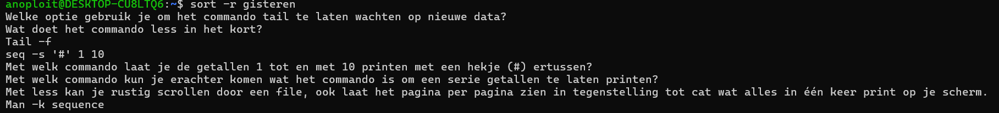

**Week 2**

Opdracht 4:
1.	Wat doet het commando less in het kort?:
* Met less kan je rustig scrollen door een file, ook laat het pagina per pagina zien in tegenstelling tot cat wat alles in één keer print op je scherm.
2.	Welke optie gebruik je om het commando tail te laten wachten op nieuwe data?
* Tail -f
3.	Met welk commando kun je erachter komen wat het commando is om een serie getallen te laten printen?
* Man -k sequence
4.	Met welk commando laat je de getallen 1 tot en met 10 printen met een hekje (#) ertussen?
* seq -s '#' 1 10

Opdracht 5:
1.	Gedaan (nano gisteren)
2.	Cat gisteren gisteren
3.	Gedaan (cat gisteren gisteren gisteren > gisteren3)
4.	Gedaan
 *	Begin van bestand springen &rarr; g
 * Einde van bestand springen &rarr; G of spatie
 *	Voor zoeken moet ik ‘/’ keyword gebruiken
 *	Volgende instantie is ‘n’
 *	Vorige instantie is ‘N’
 *	Verlaten is :q
5.	sudo ping -i.2 localhost | less
6.	less < /dev/random
7.	
 *	Cut: Cut bepaalde char en geeft het terug, bijv: echo "mosaab,saddik,20"| cut -d ',' -f 0
 *	echo -e "10\n2\n100\n5"| sort (sorteert het)
 *	head geeft eerste tien regels terug van een bestand standaard output
 *	Tail geeft laatste tien regels terug van een bestand naar standaard output
 *	Wc geeft aantal regels, woorden en bytes terug van een bestand
8.	sort -r gisteren

9.	cut -c 1 gisteren
10.	wc -l gisteren3 (geeft 27 lines)
11.	head -n 5 gisteren3
12.	tail -n 3 gisteren3
13.	head -n 5 gisteren3 | tail -n 3 (eerste 5 en dan laatste 3 daarvan dat is vanaf 3 4 5)

